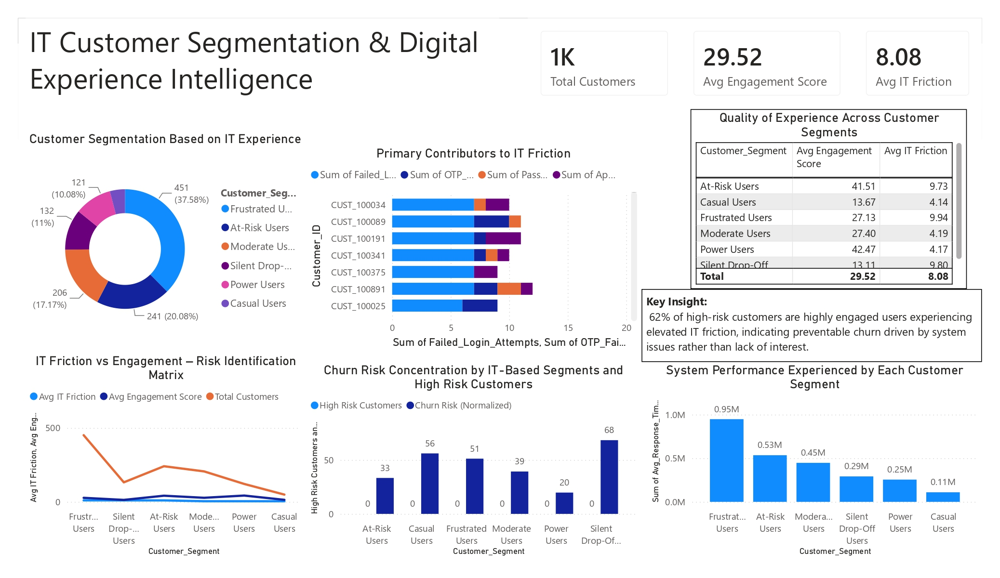

# 📊 IT Customer Segmentation & Digital Experience Intelligence Dashboard

## 📌 Project Overview

The **IT Customer Segmentation & Digital Experience Intelligence Dashboard** is a Power BI project designed to analyze customer behavior, engagement levels, IT-related friction, and churn risk patterns. The dashboard helps organizations identify high-risk customer groups, understand digital experience challenges, and improve customer retention strategies through data-driven insights.

---

## 🖥️ Dashboard Preview



---

## 🎯 Business Objective

Organizations often lose customers due to poor digital experiences rather than lack of engagement. This dashboard aims to:

- Segment customers based on their IT experience.
- Identify key contributors to IT friction.
- Detect customers at risk of churn.
- Analyze engagement patterns across customer segments.
- Improve customer satisfaction and retention through actionable insights.

---

## 📈 Key Performance Indicators (KPIs)

| Metric | Value |
|----------|----------|
| Total Customers | 1,000 |
| Average Engagement Score | 29.52 |
| Average IT Friction Score | 8.08 |


---

## 📊 Dashboard Components

### 1️⃣ Customer Segmentation Based on IT Experience

A donut chart categorizing customers into:

- Frustrated Users
- At-Risk Users
- Moderate Users
- Silent Drop-Off Users
- Power Users
- Casual Users

This visualization helps identify the distribution of customers across digital experience categories.

---

### 2️⃣ Primary Contributors to IT Friction

Analyzes the major technical issues affecting customer experience, including:

- Failed Login Attempts
- OTP Failures
- Password Reset Issues
- Application Errors

Helps identify recurring system problems impacting customer satisfaction.

---

### 3️⃣ Quality of Experience Across Customer Segments

Provides a comparative view of:

- Average Engagement Score
- Average IT Friction Score

for each customer segment.

This helps understand how technical issues affect customer engagement.

---

### 4️⃣ IT Friction vs Engagement Risk Matrix

Visualizes the relationship between:

- Customer Engagement
- IT Friction
- Customer Volume

Used to identify segments with elevated churn risk.

---

### 5️⃣ Churn Risk Concentration Analysis

Highlights customer segments with:

- High Churn Probability
- Increased Risk Scores
- Potential Retention Challenges

Supports proactive customer retention efforts.

---

### 6️⃣ System Performance Experience by Customer Segment

Measures customer experience using system response time and performance indicators.

Helps determine whether performance issues contribute to customer dissatisfaction.

---

## 🔍 Key Business Insight

> **62% of high-risk customers are highly engaged users experiencing elevated IT friction.**
>
> This indicates that churn risk is driven primarily by system and user-experience issues rather than lack of customer interest, making it a preventable business problem.

---

## 📊 Customer Segments Explained

### 🔵 Frustrated Users
Highly engaged customers experiencing significant technical issues.

### 🟣 At-Risk Users
Customers showing signs of potential churn due to poor digital experiences.

### 🟠 Moderate Users
Average engagement with moderate levels of system interaction.

### 🟪 Silent Drop-Off Users
Customers gradually disengaging from the platform.

### 🟡 Power Users
Highly active customers with strong engagement and low friction.

### 🟤 Casual Users
Low-frequency users with minimal platform interaction.

---

## 🛠️ Tools & Technologies Used

- Power BI Desktop
- Power Query
- DAX (Data Analysis Expressions)
- Data Modeling
- Data Visualization
- Customer Analytics
- Business Intelligence

---

## 📂 Dataset Features

The dataset includes:

- Customer ID
- Customer Segment
- Engagement Score
- IT Friction Score
- Failed Login Attempts
- OTP Failure Count
- Password Reset Requests
- Application Errors
- Churn Risk Indicators
- Response Time Metrics

---

## 📈 Business Value

This dashboard enables organizations to:

- Reduce customer churn.
- Improve digital customer experience.
- Identify system performance bottlenecks.
- Prioritize technical improvements.
- Enhance customer retention strategies.
- Support data-driven decision-making.

---

## 📁 Repository Structure

```text
IT-Customer-Segmentation-Digital-Experience-Intelligence/
│
├── IT_Customer_Segmentation_Dashboard.pbix
├── dashboard-preview.jpg
├── Dataset.xlsx
└── README.md
```

---

## 🚀 How to Use

1. Clone the repository.
2. Open the `.pbix` file in Power BI Desktop.
3. Load or refresh the dataset.
4. Explore customer segments and risk indicators.
5. Analyze engagement and IT friction trends.
6. Generate actionable business insights.

---

## 💡 Skills Demonstrated

- Customer Segmentation Analysis
- Churn Prediction & Risk Assessment
- Business Intelligence Reporting
- Data Modeling
- DAX Measures
- KPI Development
- Dashboard Design
- Data Visualization
- Customer Experience Analytics

---

## 👨‍💻 Author

**Yashwanth Katuru**

Aspiring Data Analyst | Power BI Developer | Business Intelligence Enthusiast

---

⭐ If you found this project helpful, please consider giving the repository a star!
